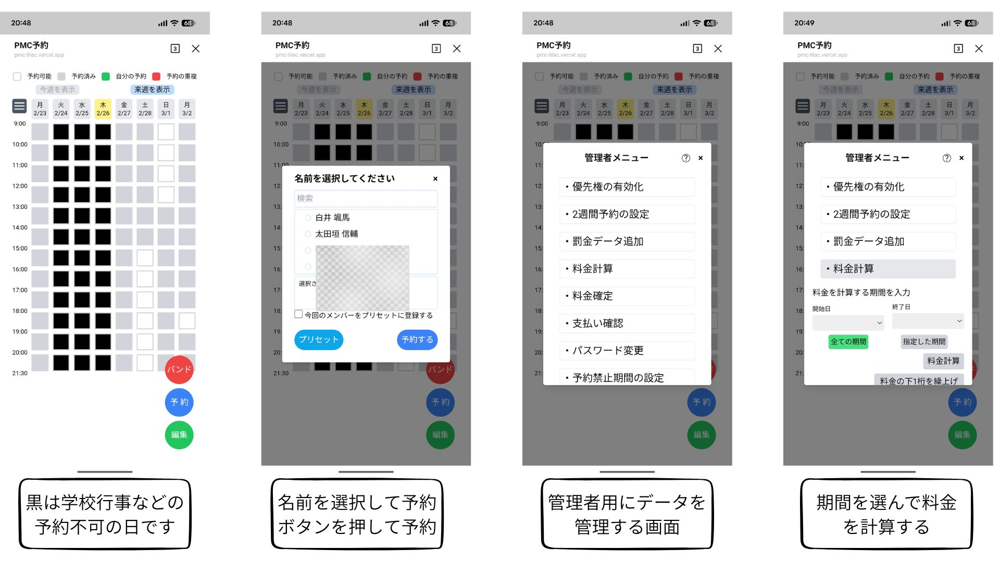

# 学内スタジオ予約システム

### 友人の音楽サークル向けに自主制作した
### LINE LIFF × Firebase の予約管理Webアプリ

---

## 背景・課題

旧来はLINEグループのカレンダーで予定を入れる形で予約していたが、情報の曖昧さが問題だった

| 課題 | 内容 |
|------|------|
| **予約者が特定できない** | 同姓同名がいるにもかかわらず苗字のみで予約されていた |
| **メンバーが不明** | バンド名のみ記入でメンバーリストが書かれていなかった |
| **費用計算が手作業** | 予約ごとに発生するスタジオ料金を毎回手計算していた |


---

## 解決策：LINE LIFF アプリとして構築

```
部員 → LINEから直接アクセス → 予約カレンダーを操作
```

### なぜ LINE LIFF を選んだか

- 旧システムがLINEグループのカレンダーだったため、部員のLINE利用が前提にあった
- 別のツールに移行すると定着しないリスクがあり、LINEの中で完結させることで移行コストを最小化
- 追加のアカウント登録・アプリインストール不要
- LINE ID を認証情報として利用でき、個人識別が容易

---

## 使用技術スタック

| カテゴリ | 技術 |
|----------|------|
| **フロントエンド** | React + TypeScript + TailwindCSS + Vite |
| **バックエンド** | Node.js（Vercel サーバーレス Functions） |
| **データベース** | Firebase Firestore（NoSQL・リアルタイム同期） |
| **認証** | LINE LIFF（LINE Front-end Framework） |
| **通知** | LINE Messaging API（プッシュ通知） |
| **その他** | SweetAlert2, xlsx |

---

## 主な機能（一般部員向け）

### カレンダー予約
- **週単位の表示**（月〜月、8日間）で予約状況を一覧確認
- **時間帯選択**：名工大は1時間単位（9:00〜21:30）、金城は授業時間割（1〜5限・夜）

### 予約操作
- バンド名・メンバー選択での予約登録
- 予約の確認・重複のハイライト表示
- プリセット機能（よく使う設定を登録）

---

## 主な機能（管理者向け）

| 機能 | 詳細 |
|------|------|
| **料金の自動計算** | 予約データから罰金・出演費・スタジオ使用料を自動集計 |
| **Excel出力** | 部費一覧をふりがな順でExcelダウンロード（手計算を廃止） |
| **予約管理** | 代理予約・編集・削除 |
| **部員管理** | 部員の登録・削除 |
| **予約フラグ** | 優先予約・2週間先予約の有効/無効を切替 |
| **禁止期間** | 特定期間の予約を禁止する区間設定 |

---

## 工夫した点

### 誰でも使いやすいUI設計
- **最短3ステップで予約完了**（日付・時間帯・バンド選択）
- カレンダーで空き状況が一目でわかるレイアウト
- 初めて使う人が迷わないよう、操作ボタンと確認ダイアログを丁寧に配置

### LINEからの移行をスムーズに
- 旧来のLINEグループ投稿に慣れた部員でも違和感なく使えるよう、
  **LINEアプリ内から直接開ける**形式（LINE LIFF）を採用
- 追加のアカウント登録・アプリインストールなしで利用開始できる

---

## 成果

- 実際に音楽サークルで使用
- カレンダー表示により、誰でも予約状況を一目で把握できるようになった
- 毎回手計算していた部費集計がすぐに完了
- 管理者の運営負担を大幅に削減

### 学んだこと
- 実際に使われるプロダクトのUX設計と要件調整
- 事前の設計が実装の手戻りを減らす上でいかに重要かを実感した
- Firebase / Firestore を使ったリアルタイムWebアプリの設計
- Node.js サーバーレスAPI + TypeScript での型安全な設計

---

## 画面例
  <div style="text-align: center">
                                                           
  
                                                           
  </div> 

---

## まとめ

| | |
|---|---|
| **課題** | 手動管理による予約の重複・費用計算の手作業 |
| **解決** | LINE LIFF + Firebase によるリアルタイム予約 + 料金自動計算 |
| **技術** | React / TypeScript / TailwindCSS / Firestore / LINE LIFF |
| **制作** | 自主制作（設計・実装・デプロイ・運用を一貫して担当） |


